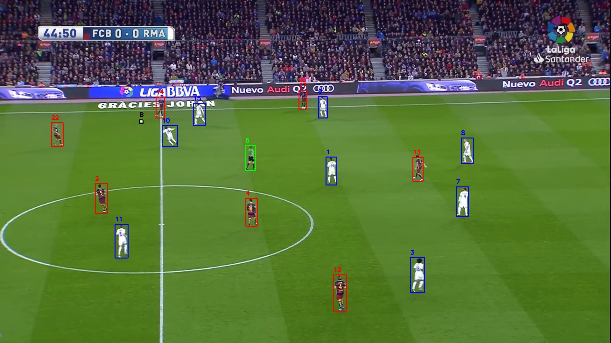
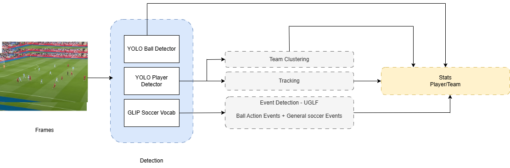

# Soccer Tracking — Multi-Object Tracking & Re-Identification

> End-to-end deep learning pipeline for real-time player and ball tracking in soccer broadcast videos, featuring team classification, jersey number recognition, and Re-ID.

Built as part of the **WS24 Interdisciplinary Project (IDP)** at TUM.



## Demo

<video src="https://github.com/user-attachments/assets/b760d236-35ba-459b-b427-5a8a94571973" controls width="100%"></video>

[Full demo videos (Google Drive)](https://drive.google.com/drive/folders/1eyM62ljdXLDRLPLwEwb2t6fNtY5PbMZ8?usp=drive_link) · [Project files (Google Drive)](https://drive.google.com/drive/folders/1Xk-h9kT8T02lWrnZvQBZrkcO-jCTNUFx?usp=drive_link)

## Pipeline



## Overview

This project implements a complete computer vision pipeline that takes a raw soccer broadcast video and produces fully annotated output with tracked players, detected balls, team assignments, and jersey IDs. The system combines detection, multi-object tracking, and re-identification into a single cohesive pipeline.

### Pipeline Stages

1. **Frame Extraction** — Extract frames from input video
2. **Player Detection** — YOLOv8/v11 player detection at high resolution
3. **Ball Detection** — Custom-trained YOLO ball detector + merged detections
4. **Spatial Filtering** — Filter spurious ball detections using spatial consistency
5. **Deep Tracking** — HMSort tracker with Deep EIoU for robust multi-object tracking
6. **Re-ID Linking** — Siamese network-based re-identification using CLIP/OSC features
7. **Team Classification** — Unsupervised clustering (UMAP + KMeans) on visual features
8. **Jersey Number Recognition** — ResNet-based player/jersey ID classification
9. **Annotation & Video Export** — Bounding box visualization with team colors + output video

## Key Components

| Component | Approach | Description |
|-----------|----------|-------------|
| **Detection** | YOLOv8/v11 | Player and ball detection with custom-trained ball model |
| **Tracking** | HMSort + Deep EIoU | Extended SORT with appearance-based deep association |
| **Re-ID** | Siamese + OSC | Optimal Similarity Clustering with InfoNCE/Triplet losses |
| **Features** | CLIP ViT-B/16 | OpenAI CLIP backbone fine-tuned for player appearance |
| **Team Clustering** | UMAP + KMeans | Unsupervised team assignment from visual features |
| **Classification** | ResNet | Jersey number and player role classification |

## Project Structure

```
src/
├── TrackingPipeline/       # Main inference pipeline (entry point)
├── blocks/                 # Network building blocks (Siamese, classifiers, transformers)
├── clipreid/               # CLIP-based Re-ID model
├── configs/                # YAML configuration files
├── datasets/               # Dataset loaders (SoccerNet, visual sim pairs, team clusters)
├── deep_eiou/              # Deep EIoU association module
├── deep_sort/              # Deep SORT tracker implementation
├── eval_soccer_net/        # SoccerNet evaluation scripts and metrics
├── event_detection/        # Match event detection module
├── hm_sort/                # HMSort tracker variants
├── losses/                 # Loss functions (InfoNCE, Triplet, Dice, BCE, KL)
├── metrics/                # Evaluation metrics (MOTA, IoU, Chamfer Distance)
├── pytorchmodels/          # Full model definitions (Siamese, Trackers, Classifiers)
├── siamese_tracking/       # Siamese-based visual tracking
├── torchreid/              # Person Re-ID utilities
├── training/               # Training loop, logging (TensorBoard + W&B)
├── lutils/                 # General utilities
├── prep/                   # Data preprocessing scripts
├── train.py                # Training entry point
├── TrackSoccernet.py       # SoccerNet benchmark evaluation
├── fit_team_cluster.py     # Team clustering pipeline
└── annotate_ball_teams.py  # Ball + team annotation
```

## Installation

```bash
git clone https://github.com/<your-username>/Soccer-Tracking.git
cd Soccer-Tracking
pip install -r requirements.txt
```

### Key Dependencies

- PyTorch 2.2 + TorchVision
- Ultralytics (YOLOv8/v11)
- OpenCV, cvzone
- einops, omegaconf, tensorboard
- transformers, open_clip (CLIP backbone)
- scikit-learn, umap-learn (clustering)

## Usage

### Inference — Full Tracking Pipeline

```python
from TrackingPipeline.main import TrackingPipeline

pipeline = TrackingPipeline(
    video_path="path/to/soccer_clip.mp4",
    output_path="output/",
    img_size=1920,
    max_frames=None
)
pipeline.run()
```

### Training — Re-ID Model

Configure hyperparameters in `src/configs/global_configs.yaml`, then:

```bash
cd src
python train.py
```

### SoccerNet Benchmark Evaluation

```python
from TrackSoccernet import TrackSoccernet

tracker = TrackSoccernet(
    dataset_root="path/to/soccernet/",
    write_path="output/tracking/"
)
tracker.track_all()
```

## Dataset

The project is built around the [SoccerNet](https://www.soccer-net.org/) dataset for training and evaluation. Additional custom datasets are used for:
- Visual similarity pair matching (Re-ID training)
- Team clustering crops
- Jersey ID classification

## Models & Training

The Re-ID module supports multiple training configurations:

- **Siamese + InfoNCE** — Contrastive learning with information noise-contrastive estimation
- **Siamese + Triplet Loss** — Metric learning with hard triplet mining
- **OSC (Optimal Similarity Clustering)** — Feature clustering objective
- **CLIP-based Re-ID** — Fine-tuned CLIP ViT backbone for appearance features

All experiments are logged to TensorBoard and Weights & Biases.

## Authors

- **Youssef Youssef** — youssef.youssef@tum.de


